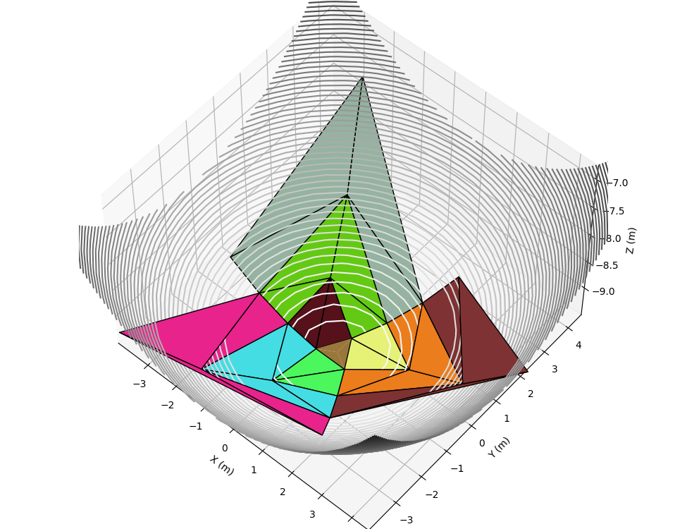

# Design of Deployable Curved-Surface Rigid Origami Flashers

Author: Sen Wang, Yinghao Gao, Hailin Huang, Bing Li, Hongwei Guo, Rongqiang Liu

Affiliation: Harbin Institute of Technology, Shenzhen

# Background

# Introduction to the Repo

The core algorithm is all in [`DCOF.py`](scripts/DCOF.py) (Deployable Curve Origami Flasher).

Four demos of design DCOF with four hubs the are given:
- [three-layer DCOF with triangle hub](scripts/triangleDCOF.py)
- [four-layer DCOF with square hub](scripts/squareDCOF.py)
- [four-layer DCOF with hexagon hub](scripts/hexagonDCOF.py)
- [four-layer DCOF with octagon hub](scripts/octagonDCOF.py)

# Import computed vertices into CAD software
I am using AutoDesk Invertor, so I will take it for example to demonstrate how to import computed vertices into CAD softwares. 

TODO export computed vertices into an excel file.

