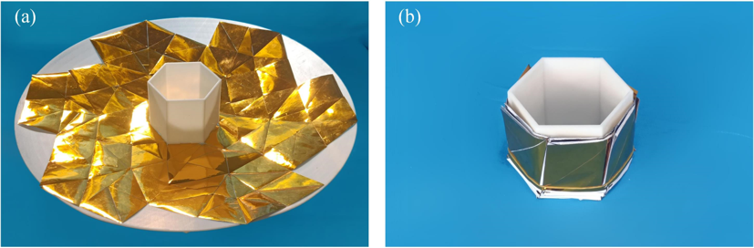

# Design of Deployable Curved-Surface Rigid Origami Flashers

Author: Sen Wang, Yinghao Gao, Hailin Huang, Bing Li, Hongwei Guo, Rongqiang Liu

Affiliation: Harbin Institute of Technology

# Background


Fig 1. Possible usage of deployable origami flashers for solar array on a spacecraft [1]

> [1]	S. A. Zirbel and R. J. Lang, "Accommodating Thickness in Origami-Based Deployable Arrays," Journal of Mechanical Design, vol. 135, 2013.

Spacecrafts are usually equipped with solar array or antenna that occupies large space (e.g. Fig 1), which is conflict to limited space of spacecrafts. Deployable origami flashers take researchers' attention because they are able to be deployed with large area and to be folded compactly.

This paper proposes an approach to designing rigid origami flashers that can be deployed onto curved-surface configurations, while most of their kind are planar like the one shown in Fig 1. The presented method enables the origami flashers to be wrapped around regular polygonal central hubs. Planar origami flashers are projected onto target spherical surfaces to obtain the vertices on the boundary creases between sections of adjacent origami flashers. The geometric relationships of thin-panel curved origami flashers are established in terms of foldability, and other vertices in each section are calculated using numerical methods. The novel designing of deployable curved-surface rigid origami flashers facilitates their potential applicability in solid surface antennas, surface reflectors, and other space engineering applications.


Fig 2. Four computed models with different hubs 

# Citation
If you find our work helpful, you are welcome to cite our paper:
```
@article{WANG2022104512,
title = {Design of deployable curved-surface rigid origami flashers},
journal = {Mechanism and Machine Theory},
volume = {167},
pages = {104512},
year = {2022},
issn = {0094-114X},
doi = {https://doi.org/10.1016/j.mechmachtheory.2021.104512},
url = {https://www.sciencedirect.com/science/article/pii/S0094114X21002664},
author = {Sen Wang and Yinghao Gao and Hailin Huang and Bing Li and Hongwei Guo and Rongqiang Liu}
```

# Introduction to the Repo

This repo serves as the attached program of  the paper. You can run the python programs that can design multiple DCOFs (Deployable Curvedf-surface Origami Flashers) and visualize them. And you also can export the computed vertices into CAD softwares so that you can fabricate prototypes from the algorithm (Fig 3).

  
Fig 3. The flow of the DCOF design algorithm

The core algorithm is all in [`DCOF.py`](scripts/DCOF.py) (Deployable Curve Origami Flasher).

Four demos of design DCOF with four hubs the are given:
- [three-layer DCOF with triangle hub](scripts/triangleDCOF.py)
- [four-layer DCOF with square hub](scripts/squareDCOF.py)
- [four-layer DCOF with hexagon hub](scripts/hexagonDCOF.py)
- [four-layer DCOF with octagon hub](scripts/octagonDCOF.py)

For example, you can run the following command in a terminal (command line) under the `scripts` directory
```
python3 hexagonDCOF.py
```


Fig 4. Run the hexagon demo

# Import computed vertices into CAD software

I am using AutoDesk Invertor, so I will take it for example to demonstrate how to import computed vertices into CAD softwares. 

Users can use `DCOF.exportVertices(filename)` to export computed vertices into an excel file (`.csv`).


Fig 4. Import the computed vertices into CAD softwares


Fig 5. Membrane prototype and thick-panel prototype


Fig 6. Thick-panel prototypes using flexible array and springs, respectively
